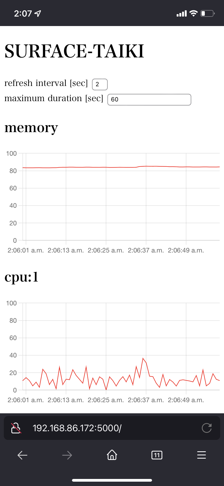
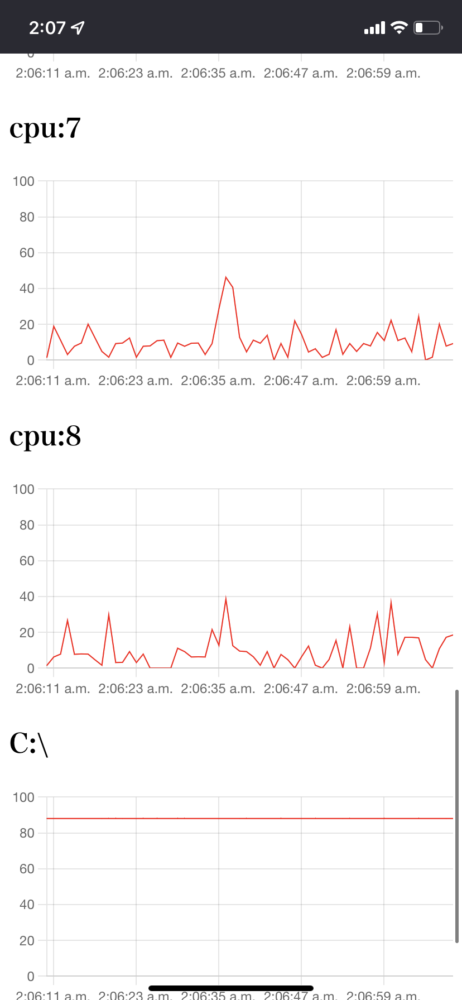

# device monitor

## install

```bash
pip install device_monitor-0.1.1-py3-none-any.whl
```

## usage
see: `device-monitor --help`

**example: save log**
```bash
device-monitor --interval 1.0 --path ./path/to/my/log.log --period 3600 --backup 24

# output
==== START ====
QUIT: Ctrl + C
1667325042.4993951,8502960128,6815670272,1687289856,1687289856,8,100.0,100.0,100.0,100.0,0.0,0.0,0.0,0.0,1,"C:\",254802915328,191183876096,63619039232
1667325043.5147758,8502960128,6803824640,1699135488,1699135488,8,62.0,69.7,71.2,73.4,15.4,16.9,0.0,0.0,1,"C:\",254802915328,191183867904,63619047424
1667325044.505984,8502960128,6820134912,1682825216,1682825216,8,44.8,40.6,43.8,44.9,0.0,0.0,0.0,9.4,1,"C:\",254802915328,191184007168,63618908160
1667325045.5114186,8502960128,6821879808,1681080320,1681080320,8,64.7,58.5,76.2,68.2,1.6,1.6,0.0,1.6,1,"C:\",254802915328,191184203776,63618711552
==== QUIT ====
```

**example: display log**
```bash
device-monitor-serve ./path/to/my/log.log --port 5050
```


